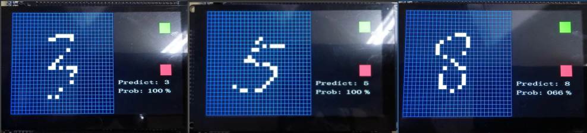

# MCU-AI-Mnist

## 1.项目简介
这是一个部署在MCU上的手写数字识别AI，MCU使用的是航芯的ACM32H5，神经网络框架用的是开源的NNOM，训练数据集使用的是Mnist，这个项目可以让大家学到如何在MCU上部署AI，希望大家喜欢。

上面是一些测试时的效果，绿色方块是确认键，红色方块是清除键，predict是预测结果，prob是预测概率。

## 2.模型训练
训练可以参考开源的NNOM项目，需要先在PC上搭建Python环境，在TensorFlow框架上使用Keras训练模型。

NNOM开源项目地址：https://github.com/majianjia/nnom

## 3.模型部署
上面训练完就可以导出一个weights.h文件，把这个weights.h文件和NNOM库都移植到MCU上就能把模型部署到MCU上了，详细部署可以参考我提供的源码。